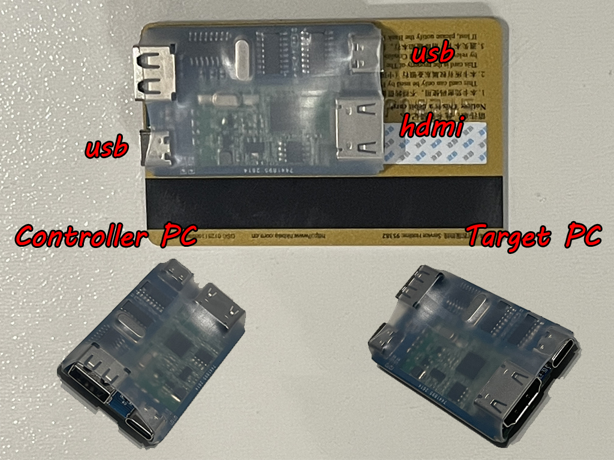
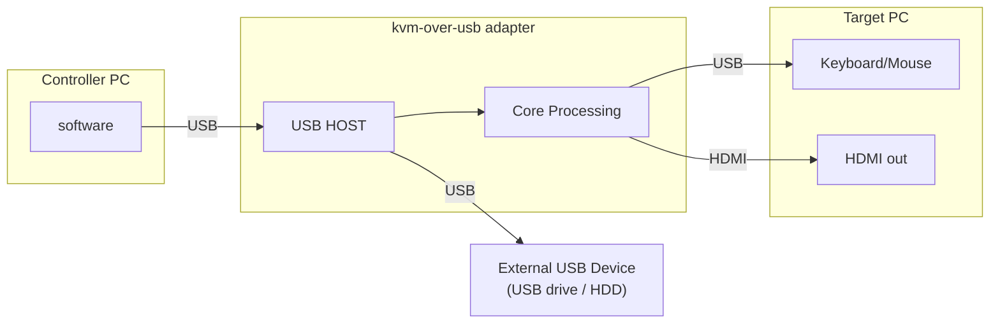

# KvmOverUsb
A plug-and-play KVM (Keyboard Video Mouse) device control.  Control any PC's keyboard/mouse over serial with interactive preview, web viewer, and TCP API for AI automation.

## [Buy from Ebay](https://www.ebay.com/itm/267633782822)

## What It Does

Control any PC's keyboard and mouse over USB while watching its screen via HDMI capture — all from another PC, a script, or an AI agent.

## Features

HID protocol transmission, driver-free

Support BIOS keyboard control

Upper computer program compatible with non-board video capture card

On-board USB-HUB chip, reduce the number of interfaces

Single MCU dual USB Device controller, reduce transmission delay

The USB-A socket, used for USB expansion of the Controller PC, can connect wireless keyboards, Mouse, USB flash drives, external hard drives, and other USB devices.

## There are many, many open-source software options to choose from

[Jackadminx](https://github.com/Jackadminx) / [KVM-Card-Mini](https://github.com/Jackadminx/KVM-Card-Mini)

[ElluIFX](https://github.com/ElluIFX) / [KVM-Card-Mini-PySide6](https://github.com/ElluIFX/KVM-Card-Mini-PySide6)

[binnehot](https://github.com/binnehot) / [KVM-over-USB](https://github.com/binnehot/KVM-over-USB)

[tobychui](https://github.com/tobychui) / [DezKVM-Go](https://github.com/tobychui/DezKVM-Go)

[mofeng-git](https://github.com/mofeng-git) / [One-KVM](https://github.com/mofeng-git/One-KVM)

[sunasaji](https://github.com/sunasaji) / [serial-hid-kvm](https://github.com/sunasaji/serial-hid-kvm)

[sunasaji](https://github.com/sunasaji) / [mcp-serial-hid-kvm](https://github.com/sunasaji/mcp-serial-hid-kvm)

[sunasaji](https://github.com/sunasaji) / [cli-serial-hid-kvm](https://github.com/sunasaji/cli-serial-hid-kvm)

### FAQ

Q: Why doesn't the mouse work when the controlled end is a Linux distribution?

A: Some operating systems do not support the mouse in absolute coordinate mode. Please try switching to relative coordinate mode for operation.

Q: How to send the Ctrl + Alt + Delete key combination?

A: To send these key combinations to the controlled end, it is recommended to use the shortcut function in the Keyboard menu.

