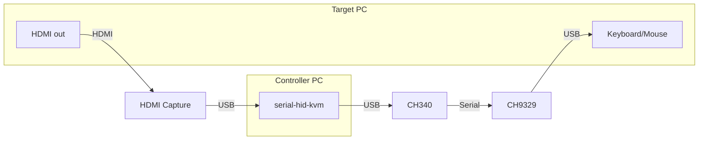

# KvmOverUsb
A plug-and-play KVM (Keyboard Video Mouse) device control.  Control any PC's keyboard/mouse over serial with interactive preview, web viewer, and TCP API for AI automation.

## What It Does

Control any PC's keyboard and mouse over USB while watching its screen via HDMI capture — all from another PC, a script, or an AI agent.

## Features

HID protocol transmission, driver-free
Support BIOS keyboard control
Upper computer program compatible with non-board video capture card
On-board USB-HUB chip, reduce the number of interfaces
Single MCU dual USB Device controller, reduce transmission delay
The USB-A socket, used for USB expansion of the host side, can connect wireless keyboards, Mouse, USB flash drives, external hard drives, and other USB devices.

## There are many, many open-source software options to choose from

[sunasaji](https://github.com/sunasaji) / [mcp-serial-hid-kvm](https://github.com/sunasaji/mcp-serial-hid-kvm)
[sunasaji](https://github.com/sunasaji)/[cli-serial-hid-kvm](https://github.com/sunasaji/cli-serial-hid-kvm)
[Jackadminx](https://github.com/Jackadminx)/[KVM-Card-Mini](https://github.com/Jackadminx/KVM-Card-Mini)
[ElluIFX](https://github.com/ElluIFX)/[KVM-Card-Mini-PySide6](https://github.com/ElluIFX/KVM-Card-Mini-PySide6)
[binnehot](https://github.com/binnehot)/[KVM-over-USB](https://github.com/binnehot/KVM-over-USB)
