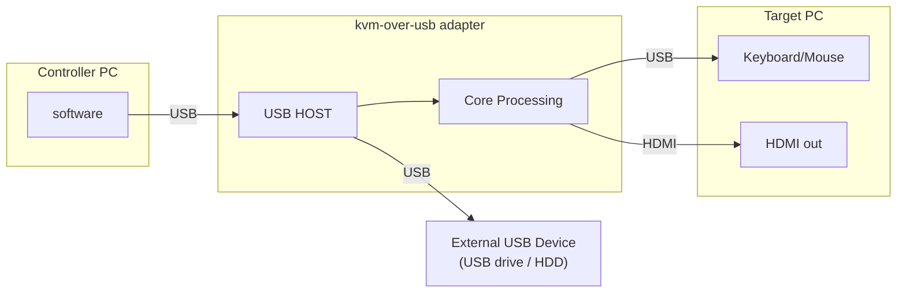

# KvmOverUsb
A plug-and-play USB HID KVM adapter — CH9329 for keyboard and mouse control, MS2109 for HDMI capture. Driver-free, works down to BIOS, and it runs with the existing CH9329 software ecosystem.


## What It Does

Control any PC's keyboard and mouse over USB while watching its screen via HDMI capture — all from another PC, a script, or an AI agent.


```mermaid
flowchart LR
    subgraph Controller["Controller PC"]
        APP[software]
    end

    subgraph Middle["kvm-over-usb adapter"]
        USBHOST[USB HOST]
        DEVICE[Core Processing]
    end

    subgraph Target["Target PC"]
        HID["Keyboard/Mouse"]
        HDMI_OUT["HDMI out"]
    end

    APP -- USB --> USBHOST
    USBHOST --> DEVICE
    DEVICE -- HDMI --> HDMI_OUT
    DEVICE -- USB --> HID

    USBHOST -- USB --> EXT["External USB Device<br>(USB drive / HDD)"]
```

## Features

HID protocol transmission, driver-free

Support BIOS keyboard control

Upper computer program compatible with non-board video capture card

On-board USB-HUB chip, reduce the number of interfaces

Single MCU dual USB Device controller, reduce transmission delay

The USB-A socket, used for USB expansion of the Controller PC, can connect wireless keyboards, Mouse, USB flash drives, external hard drives, and other USB devices.

## Serial baud rate

**The CH9329 on this board ships at 9600 baud — its factory default.**

That is deliberate. 9600 is also what most existing CH9329 software expects, so the board works with the current ecosystem out of the box: no per-unit configuration, and no changes required to any software project.

It is still the single most common cause of "the video works but the keyboard and mouse do nothing". A baud mismatch is silent: video is unaffected, host software usually reports the serial port as connected, and keystrokes simply never arrive. A green "connected" status is not proof that input will get through.

- `serial-hid-kvm`, `KVM-over-USB` and `One-KVM` all default to 9600. Nothing to do.
- `DezKVM-Go` defaults to **115200**. Set **Settings → Serial Baud → 9600**; the page reconnects by itself.

## Software

These are independent community projects. None of them is bundled with, endorsed by, or supported through this board — they are listed because they work with it. Pick whichever suits you.

Every baud figure below was read out of that project's source, and the list was checked against this hardware on **2026-09-30**: the CH9329 answers a `GET_INFO` query at 9600 and stays silent at 115200, it enumerates as CH340 `1A86:7523` on the control side and `345F:2109` on the capture side behind the on-board hub, and a keyboard HID packet came back acknowledged with a valid checksum. If a project later changes its default, that date is the one to trust.

### No configuration needed

| Project | Type | Notes |
|---|---|---|
| [canwdev / web-mediadevices-player](https://github.com/canwdev/web-mediadevices-player) | Browser (Web Serial) | Web viewer with CH9329 keyboard/mouse control, screenshots and recording. Also builds as a Tauri desktop app. |
| [mofeng-git / One-KVM](https://github.com/mofeng-git/One-KVM) | Desktop + web | `ch9329_baudrate` already defaults to 9600. |
| [sipper69 / Control3](https://github.com/sipper69/Control3) | Windows desktop | C# laptop KVM, `BaudRate` defaults to 9600. |
| [binnehot / KVM-over-USB](https://github.com/binnehot/KVM-over-USB) | Desktop GUI | PySide client, CH9329 serial mode. |
| [sjmf / kvm-serial](https://github.com/sjmf/kvm-serial) | Cross-platform (Python) | `pip install kvm-serial`. `--baud` flag if the chip was reconfigured. Also drives CH9350L. |
| [sunasaji / serial-hid-kvm](https://github.com/sunasaji/serial-hid-kvm) | Desktop + web + API | `pip install serial-hid-kvm`. Preview window, browser viewer, TCP JSON Lines API. |
| [sunasaji / cli-serial-hid-kvm](https://github.com/sunasaji/cli-serial-hid-kvm) | CLI | Front-end for serial-hid-kvm, with OCR screen reading. |
| [sunasaji / mcp-serial-hid-kvm](https://github.com/sunasaji/mcp-serial-hid-kvm) | MCP server | Lets AI agents drive the target PC directly. |
| [hitmoon / guvc-kvm](https://github.com/hitmoon/guvc-kvm) | Linux | guvcview-based, exposes a VNC server. |

Browser-based options need Chrome, Edge or another Chromium browser, because they use the Web Serial API. Firefox and Safari are not supported.

### Works after changing one setting

| Project | Type | Notes |
|---|---|---|
| [tobychui / DezKVM-Go](https://github.com/tobychui/DezKVM-Go) | Browser (Web Serial) | Defaults to 115200 — set **Settings → Serial Baud → 9600**. |
| [davidkim-code / kvm](https://github.com/davidkim-code/kvm) | Browser / Android Chrome | NanoKVM-USB fork with a baud rate selector for DIY CH9329 hardware. |
| [KaroUniform / irbis-kvm](https://github.com/KaroUniform/irbis-kvm) | macOS 14+ | UVC capture plus a CH9329 UART bridge, with a baud selector. |

### macOS

Support is thin here. `irbis-kvm` is the only macOS client found, and its source is not published in that repository. Everything else is Windows, Linux or browser-based — and the browser options run on macOS only in Chromium.

## CH9329 configuration tool

You should not need this for normal use. It is only relevant if you deliberately want to change the chip's baud rate.
`CH9329Test_CfgTool.exe` in this repository is the official WCH tool, mirrored here for convenience:

- Version `1.4.0.0`, `Copyright (C) WCH 2025`
- Digitally signed by `Nanjing Qinheng Microelectronics Co., Ltd.`, DigiCert timestamped
- SHA256 `FB65F3F3823407DAF473E5F329CCB825FF0E4DE31A4534043F897D1282C709C9`

Prefer to download it from the vendor instead:
https://www.wch.cn/downloads/CH9329_ZIP.html

Verify before running — right click the file → Properties → Digital Signatures, and confirm the signer is `Nanjing Qinheng` with a valid status. Or:

```powershell
Get-FileHash .\CH9329Test_CfgTool.exe -Algorithm SHA256
```

When you do run it, keep your existing wiring. With Host USB-C connected to the controller PC, the board enumerates a CH340 virtual serial port (a COM port on Windows, `/dev/ttyUSB*` on Linux) — select that port in the tool. **No rewiring required**, and do not disconnect Target USB-C.

### FAQ

Q: The video works, but the keyboard and mouse do nothing. What is wrong?

A: Almost always a baud rate mismatch. See [Serial baud rate](#serial-baud-rate).

Q: Why doesn't the mouse work when the controlled end is a Linux distribution?

A: Some operating systems do not support the mouse in absolute coordinate mode. Please try switching to relative coordinate mode for operation.

Q: How to send the Ctrl + Alt + Delete key combination?

A: To send these key combinations to the controlled end, it is recommended to use the shortcut function in the Keyboard menu.

Q: What VID/PID does this board enumerate as?

A: The MS2109 capture side is `345F:2109` (UVC video, USB audio, HID) and the CH9329 control side is a CH340 at `1A86:7523`. Both sit behind the board's on-board USB hub.

## Where to get:
### https://www.ebay.com/usr/4917450
### https://www.tindie.com/stores/cxandy/

## License

The documentation in this repository is MIT licensed — see [LICENSE](LICENSE).

`CH9329Test_CfgTool.exe` is the exception. It is a WCH binary, redistributed
unmodified for convenience, and remains under WCH's terms.
